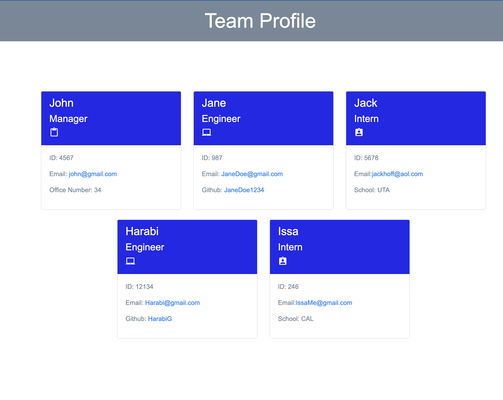

# Team Profile Generator 

# Description 
This application was created to generate a team profile based on user input using the Inquirer module from Node.js and displaying the information on a newly created html page with a style sheet. This project demonstrates use of OOP and TDD using Jest. 
 
# Table of Contents

<li><a href="#installation">Installation</a></li>
<li><a href="#usage">Usage</a></li>
<li><a href="#license">License</a></li>
<li><a href="#tests">Tests</a></li>
<li><a href="#contact">Contact</a></li>

# Installation 
The user should clone the repository from GitHub and download Node. This application also requires a file system and inquirer module. If testing is required, this application uses Jest. 

# Usage 
Use inquirer from your command line to answer questions about your project.
View walk through video here - [Screencastify]https://drive.google.com/file/d/1s-vCwhmBN4eOSOb_wh4Cs05lIz-8hf5t/view 

# License 
This project is license under MIT

# Tests
Run `npm test` to run Jest for tests on constructors. 

# Contact
If you have any questions about this projects, please contact me directly at <a href="mailto:JnguyeningCo@gmail.com">John Nguyen</a>. You can view more of my projects and LinkedIn below:

<li><a href="mailto:jnguyeningco@gmail.com">Email</a>
<li><a href="https://www.linkedin.com/in/john-nguyen-49158621a">Linked In</a>
<li><a href="https://github.com/JoNoC0">GitHub JoNoC0</a>
